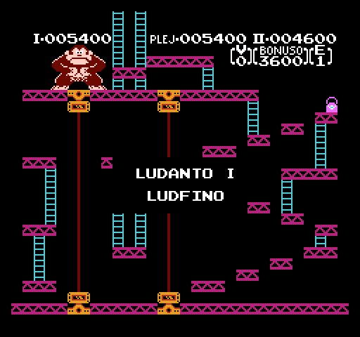

# Donkey Kong

_Legu
[donkeykong-readme.txt](donkeykong-readme.txt) por esperanta
priskrbo._

This project is a fan translation of
[Donkey Kong](https://en.wikipedia.org/wiki/Donkey_Kong), a
video game for the Nintendo Entertainment System, to Esperanto.
All copyrights on the original game belong to Nintendo.

You *must* own a physical copy of the Donkey Kong cartridge.
Downloading the ROM of any game which you do not own may be
considered piracy.

  * Donkey Kong (World) (Rev A) - CRC32 `E40B593B`

Special thanks to RussianManSMWC for
[Donkey Kong NES Disassembly](https://github.com/RussianManSMWC/Donkey-Kong-NES-Disassembly).

## Screenshots

Here are some pretty screenshots:

